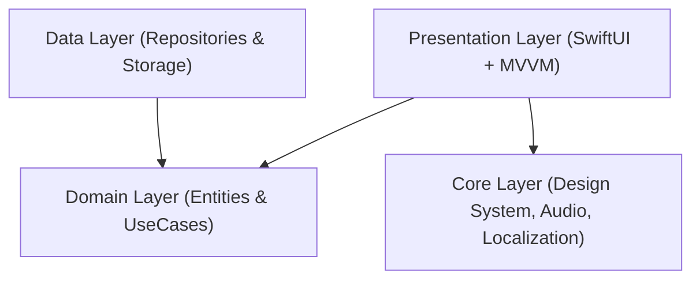

# PamWorkout — Functional Specification & Architecture Index

**Project:** PamWorkout iOS App  
**Architecture:** Clean Architecture + MVVM (SwiftUI, Swift 6)  
**Standard:** BABOK® v3 / IEEE 830 / ISO 29148  

---

## 📑 Feature Documentation Index

This directory contains the detailed business and functional specifications for each module of the **PamWorkout** application:

| Index | Module Name | Document Link | Description |
| :---: | :--- | :--- | :--- |
| **01** | **Interval Timer Engine** | [`01_Interval_Timer.md`](./01_Interval_Timer.md) | Dual-phase circular timer, configurable sets/work/rest, audio chimes & haptics. |
| **02** | **Background & Live Activities** | [`02_Background_Processing_And_Live_Activities.md`](./02_Background_Processing_And_Live_Activities.md) | Date math background resiliency, ActivityKit Dynamic Island, Audio Ducking. |
| **03** | **Workout Engine & Domain** | [`03_Workout_Engine_And_Domain.md`](./03_Workout_Engine_And_Domain.md) | Push-Pull-Legs-Rest split cycle, Cardio elimination logic, Clean Architecture layers. |
| **04** | **Design System & Theming** | [`04_Design_System_And_Theming.md`](./04_Design_System_And_Theming.md) | Apple Health-style system grouped design tokens, dynamic dark/light elevation. |
| **05** | **Settings & Localization** | [`05_Settings_Profile_And_Localization.md`](./05_Settings_Profile_And_Localization.md) | User profile, BMI calculation, appearance settings, vi/en localization. |
| **06** | **DevOps & Hybrid Deploy** | [`06_DevOps_And_Hybrid_Deployment.md`](./06_DevOps_And_Hybrid_Deployment.md) | Single-command USB/Wi-Fi deployment engine (`deploy.sh`), usbipd UAC automation. |

---

## 🏛 System Architecture Overview

